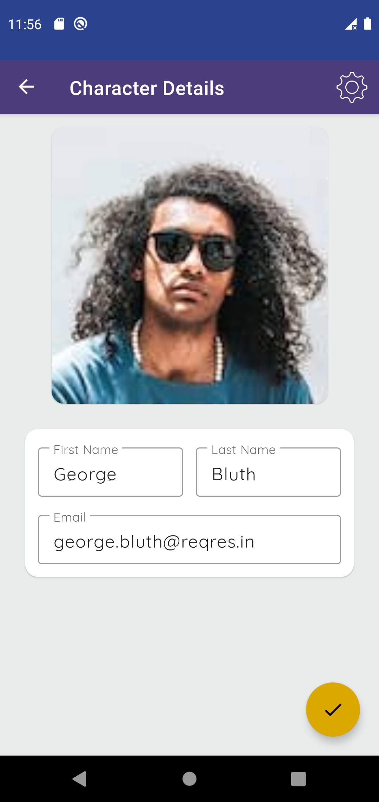
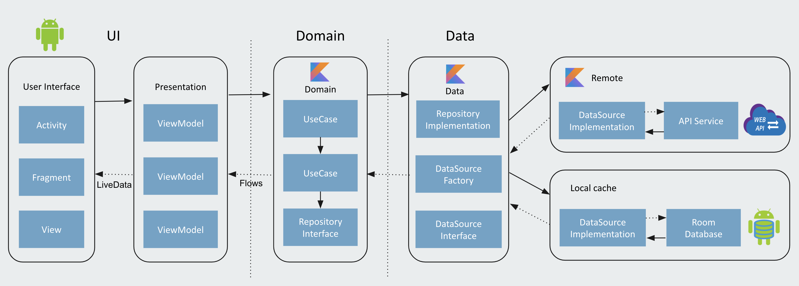

# Rubikans Challenge
The Rubikans Challenge App consuming a [Reqres.in API](https://reqres.in/) to display Characters it has been built with clean architecture principles, Repository Pattern, and MVVM pattern as well as Architecture Components.

**App features:**
- List of characters
- Search in loaded characters
- Detail of characters
- Light/ Dark theme.

## Screenshots

  
  
  
  
  
  
  
  
  
  

## Architecture
Uses concepts of the notorious Uncle Bob's architecture called [Clean Architecture](https://blog.cleancoder.com/uncle-bob/2012/08/13/the-clean-architecture.html). 

* Better separation of concerns. Each module has a clear API., Feature related classes life in different modules and can't be referenced without explicit module dependency.
* Features can be developed in parallel eg. by different teams
* Each feature can be developed in isolation, independently from other features
* faster compile time
  

## Modules:
* **app** - It uses all the components and classes releated to Android Framework. It gets the data from presentation layer and shows on UI. (**access all the modules**)
* **presentation** - MVVM with ViewModels exposing LiveData that the UI consume. The ViewModel does not know anything about it's consumers. (Android module that **can only access domain module**)
* **domain** - The domain layer contains the UseCases that encapsulate a single and very specific task that can be performed. This task is part of the business logic of the application. (Kotlin module that **cannot access any other module**)
* **data** - The data layer implements the repository interface that the domain layer defines. This layer provide a single source of truth for data. (Kotlin module that **can only access domain module**)
* **remote** - Handles data interacting with the network. (**can only access data module**)
* **cache** - Handles data interacting with the local storing (Room DB). (**can only access data module**)

## Tech stack - Library:

- [Kotlin](https://kotlinlang.org/)
- [Coroutines](https://github.com/Kotlin/kotlinx.coroutines) - A coroutine is a concurrency design pattern that you can use on Android to simplify code that executes asynchronously
- [Flow](https://kotlin.github.io/kotlinx.coroutines/kotlinx-coroutines-core/kotlinx.coroutines.flow/) - Flow is used to pass (send) a stream of data that can be computed asynchronously
- [Dagger-Hilt](https://developer.android.com/training/dependency-injection/hilt-android) - for dependency injection.
- JetPack
    - [LiveData](https://developer.android.com/topic/libraries/architecture/livedata) - For reactive style programming (from VM to UI).
    - [ViewModel](https://developer.android.com/topic/libraries/architecture/viewmodel) - Stores UI-related data that isn't destroyed on UI changes.
    - [Room](https://developer.android.com/topic/libraries/architecture/room) - Used to create room db and store the data.
    - [Navigation](https://developer.android.com/guide/navigation/navigation-getting-started) - Used to navigate between fragments
    - [Data Binding](https://developer.android.com/topic/libraries/data-binding) - Used to bind UI components in your XML layouts.
- [Material-Components](https://github.com/material-components/material-components-android) - Material design components like ripple animation, cardView.
- [Retrofit](https://github.com/square/retrofit) - Used for REST api communication.
- [OkHttp](http://square.github.io/okhttp/) - HTTP client that's efficient by default: HTTP/2 support allows all requests to the same host to share a socket
- [Gson](https://github.com/google/gson) - Used to convert Objects into their JSON representation.
- [Timber](https://github.com/JakeWharton/timber) - Used for logging.
- [Glide](https://bumptech.github.io/glide/) - Glide is a fast and efficient image loading library for Android

##    How to run this app
- Clone this repository
- Build & Run the application
